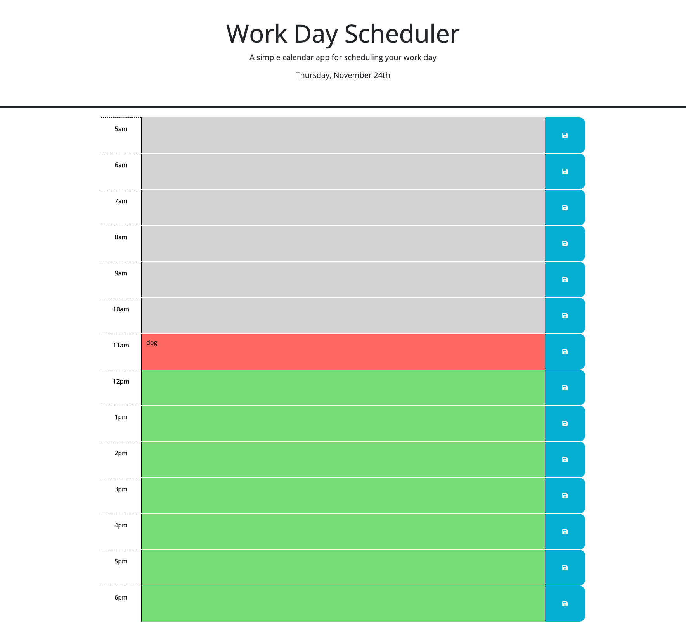

# Work-Day-Scheduler

***
## Description
The challenge was to create a work-day scheduler.  Each hour box changes color depending on the current time.  Time that has passed is gray, current time is red and the future time is green.  When entering in the box and pressing the save icon, the entry saves on the local storage using json.  Then when going back to the website the entry appears again.

## Links
github SSH: https://github.com/rypab4/Work-Day-Scheduler.git
github repository: https://github.com/rypab4/Work-Day-Scheduler
website:  https://rypab4.github.io/Work-Day-Scheduler/

## Directions
open the website https://rypab4.github.io/Work-Day-Scheduler/

Enter comments in any hour slot and press the save button.  When you leave the website the comments should still be there.